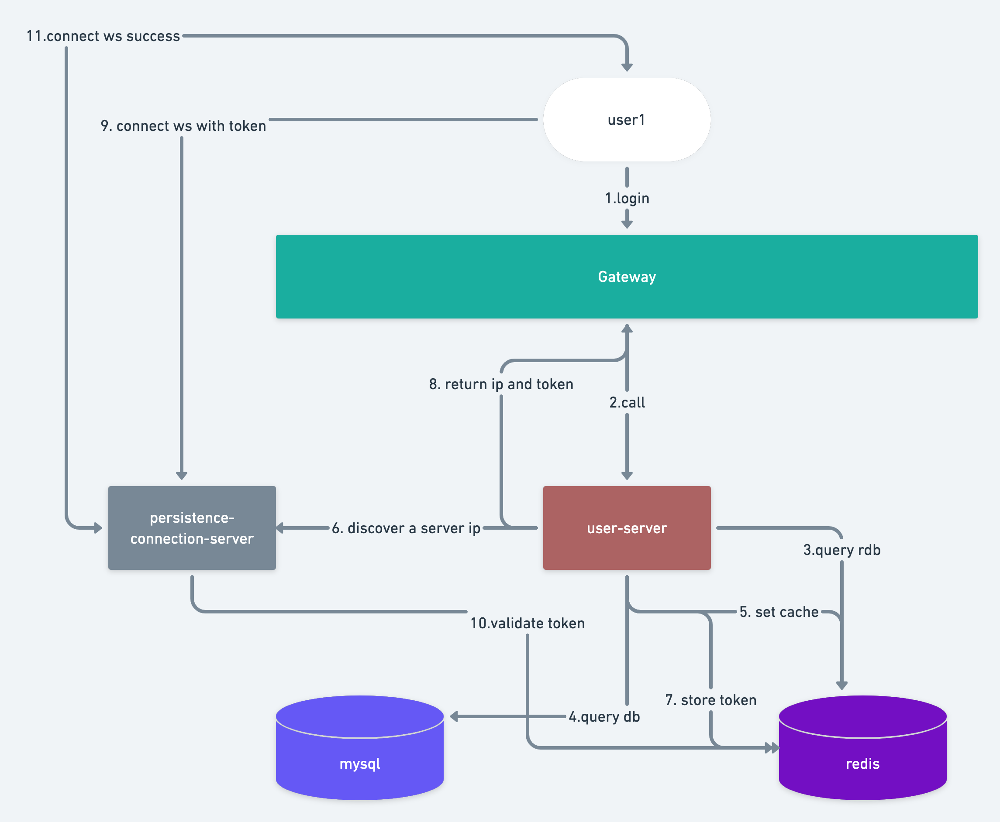
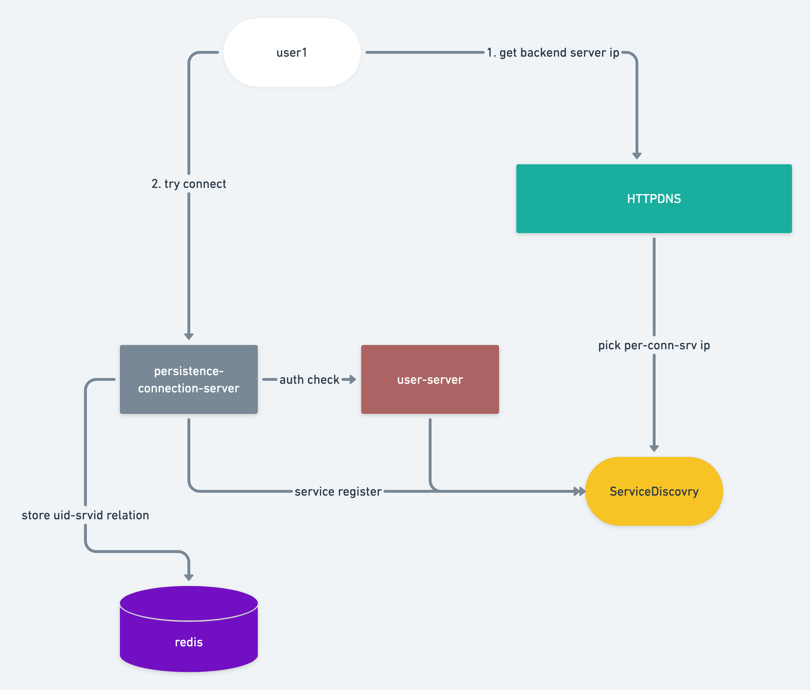

# goim

IM Server written by golang.

选型参考：[https://zhuanlan.zhihu.com/p/31377253](https://zhuanlan.zhihu.com/p/31377253)

## Desing

## user connect to server with websocket

客户端如何连接长连接服务，目前我有两个方案各有优缺点，但是还没确定。

### 反向代理方案

客户端统一入口在 gateway 上，gateway 支持反向代理能力，客户端发起长连接请求时，代理到后端的服务（这里准备使用一致性哈希来确定转发到哪台机器上）

优点:

- 入口统一，且可以在 gateway 上完成鉴权等操作
- 后端服务无需暴露 ip，且可任意扩缩容

缺点：

- gateway 需要承受长连接带来的压力，需要更多的 gateway 来承受大量在线用户的情况

### httpdns 方案

客户端先通过暴露的域名，去访问 httpdns 服务获取真正后端服务的 ip，然后通过 ip 直接进行长连接

优点：

- 客户端与长连接服务器直连，减少代理层的压力

缺点：

- 没有统一的鉴权入口，入口分散
- 要求暴露后端服务 ip，安全性降低且比较浪费 ip 资源

## send/rec msg

IM 数据将在 HBASE 上存储，关系型数据存在 MySQL

