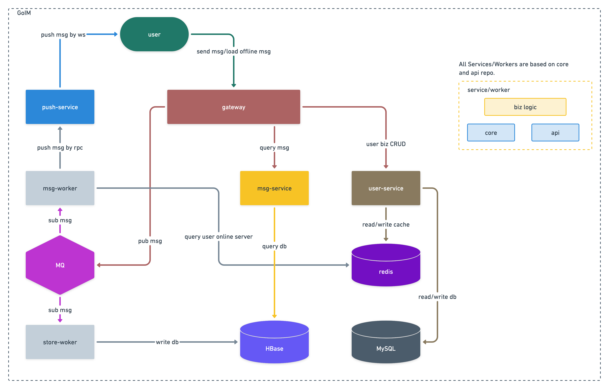

# goim

Instant Messaging Server written by golang.

> 选型参考：[https://zhuanlan.zhihu.com/p/31377253](https://zhuanlan.zhihu.com/p/31377253)

当前架构:

详细文档请在官网查看:[https://go-goim.github.io](https://go-goim.github.io/)
