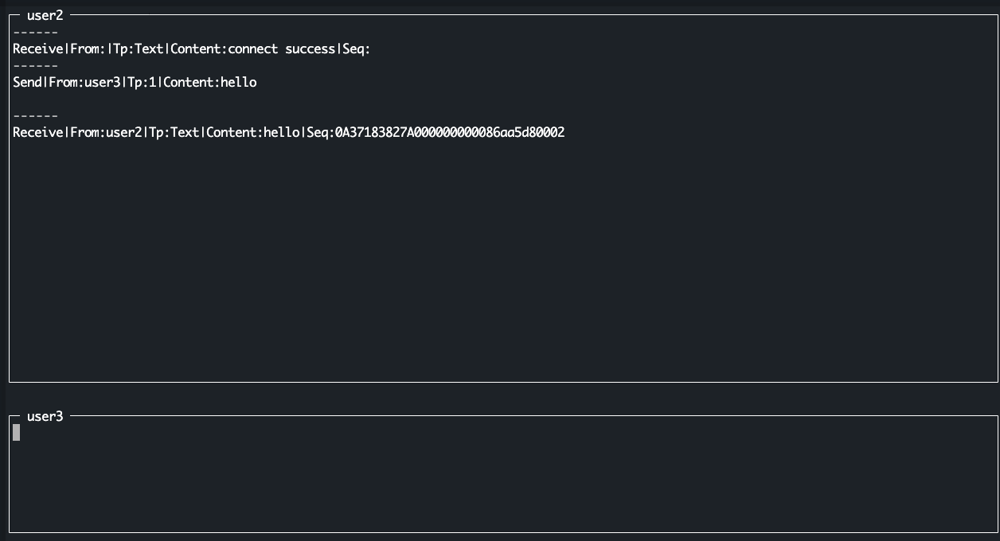

## How to run it

服务提供一个简单的终端 GUI 可以测试消息的发送和接受，代码在 `tests` 目录下。

在 `goim/test` 目录下执行如下命令：

```shell
make run-gui UID=user3 TOUID=user2
```

**支持参数:**

```shell
  -s string
        gateway server addr (default "127.0.0.1:18071")
  -t string
        to user id
  -u string
        from user id
```

界面如下：


